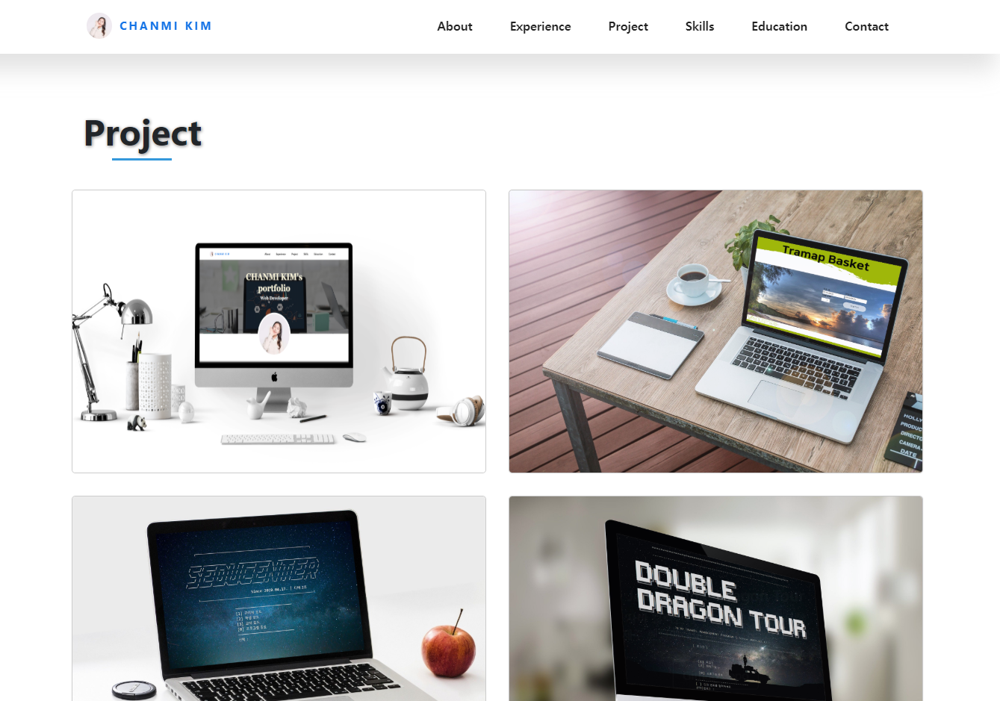
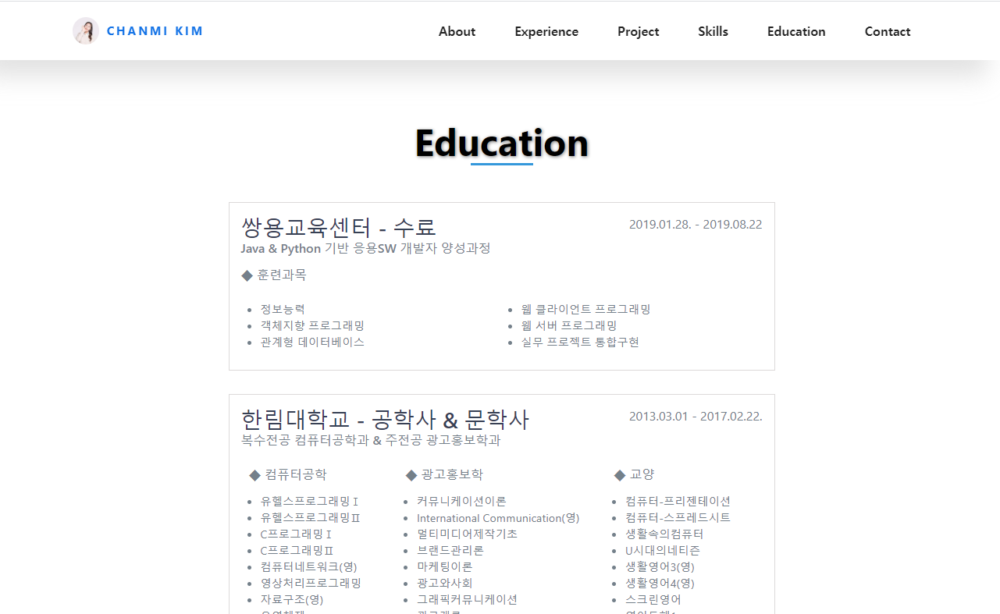

# CHANMI KIM's Portfolio

**김찬미의 포트폴리오 | [▶ Preview](https://chanmi-kim.github.io/portfolio)** 

### 👋 Introduction

<table>
    <tr>
        <th>프로젝트명</th>
        <th>Portfolio</th>
        <th>개발 기간</th>
        <th>2019.05.30. ~ 2019.06.14.  (일 4시간, 총 12일)</th>
    </tr>
    <tr>
        <th>프로젝트 성격</th>
        <th>토이 프로젝트</th>
        <th>개발 인원</th>
        <th>개인 / 1명</th>
    </tr>
      <tr>
        <th>프로젝트 개요</th>
        <th>싱글페이지 포트폴리오 웹 사이트</th>
        <th>개발 환경</th>
        <th>Visual Studio Code</th>
    </tr>
        <tr>
        <th>주요 기술</th>
        <th>HTML5, CSS3, JavaScript</th>
        <th>비고</th>
        <th> </th>
    </tr>
    <tr>
        <th>본인역할</th>
        <th colspan="3">프로젝트 기획, UI 설계, 웹 사이트 제작</th>
    </tr>
</table>

### 📷 Appearance

Git Pages와 HTML5, CSS3, JavaScript를 이용한 싱글페이지 포트폴리오 정적 웹 사이트입니다.

<table>
    <tr>
        <th>About</th>
        <th>Experience</th>
        <th>Project</th>
    </tr>
    <tr>
        <td></td>
        <td></td>
        <td></td>
    </tr>
        <tr>
        <th>Skills</th>
        <th>Eduction</th>
        <th>Contact</th>
    </tr>
    <tr>
        <td></td>
        <td></td>
        <td></td>
    </tr>
</table>

